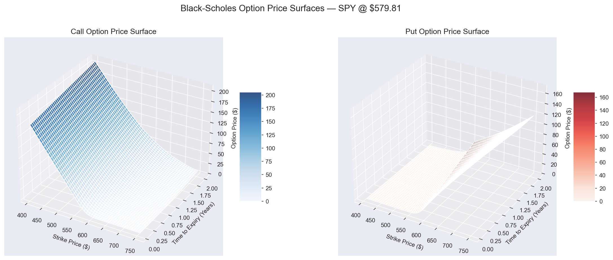
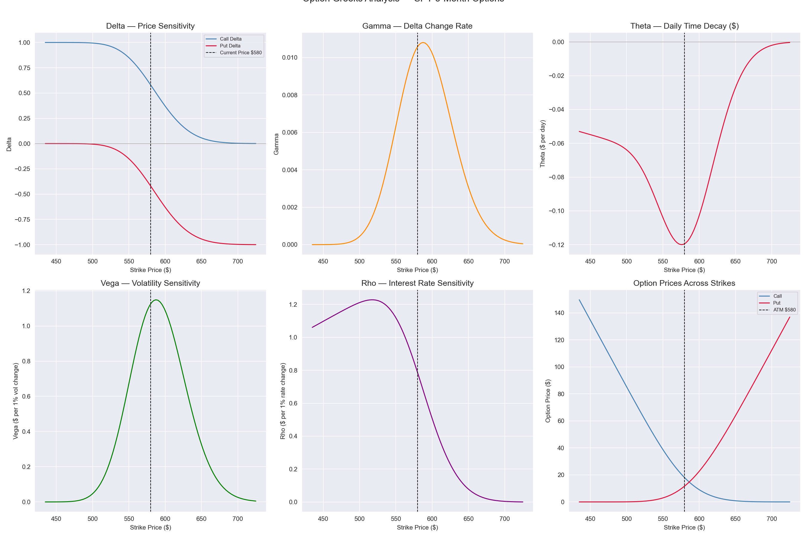
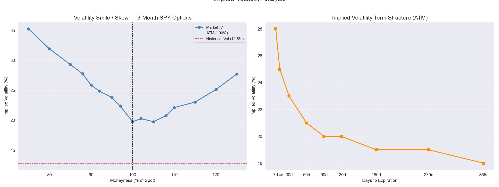
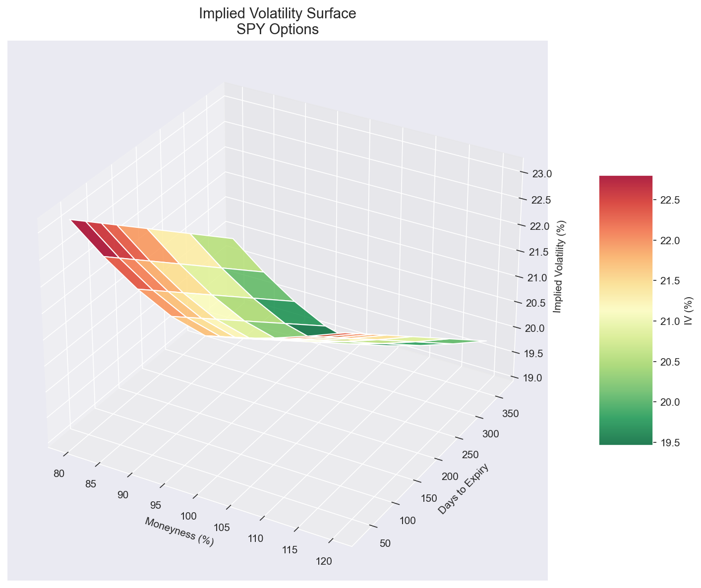
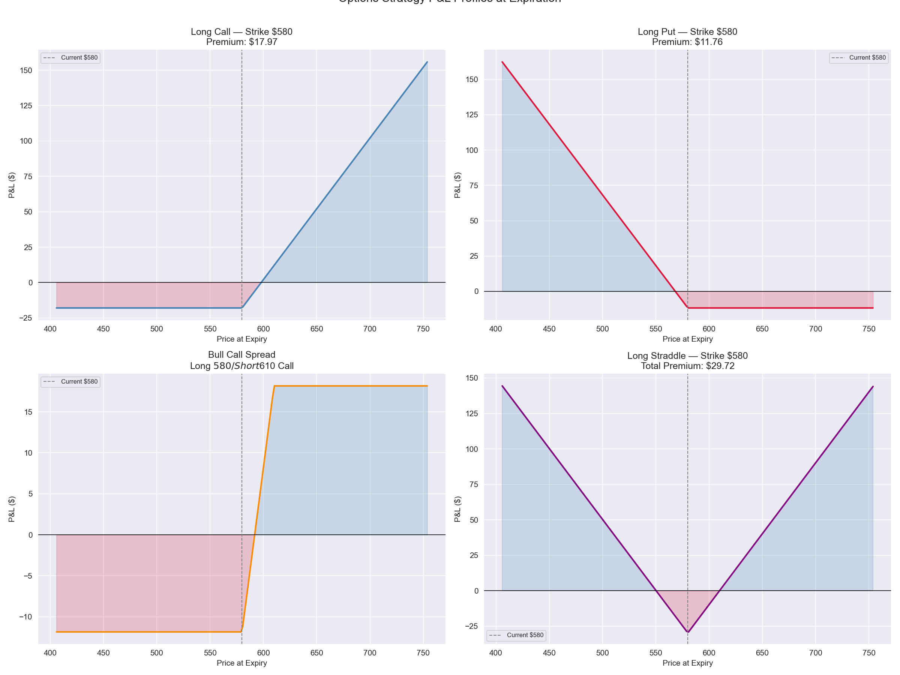
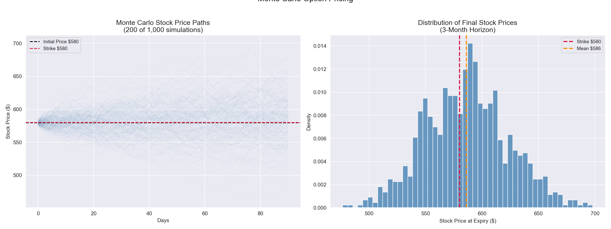
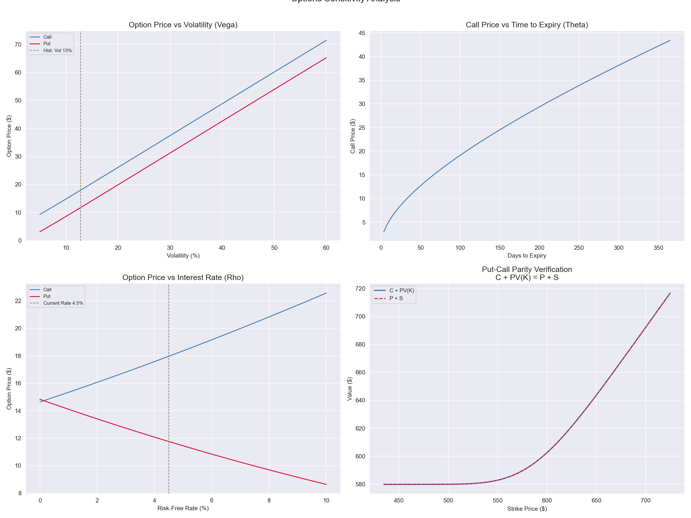

# Options & Derivatives Pricing Analysis — Black-Scholes, Implied Volatility & Greeks

A Python implementation of the Black-Scholes option pricing model applied to real SPY market data (2023–2024), computing all five Greeks, constructing implied volatility surfaces, analyzing the volatility smile, pricing common options strategies, and validating with Monte Carlo simulation.

---

## Problem Statement
Options and derivatives are the foundation of modern financial risk management. This project implements quantitative finance tools used daily by derivatives traders and risk managers to answer:
- How does Black-Scholes price options across strikes and maturities?
- How do the Greeks quantify and manage options risk?
- What does the implied volatility surface reveal about market expectations?
- How does the volatility smile reflect asymmetric tail risk pricing?
- Do Monte Carlo and analytical prices converge?

---

## Market Parameters
- **Underlying:** SPY (S&P 500 ETF)
- **Current Price:** $579.81
- **Historical Volatility:** 12.83%
- **Risk-Free Rate:** 4.50%
- **Analysis Period:** 2023–2024

---

## Models & Methods Implemented

| Method                    | Description                               |
|---------------------------|-------------------------------------------|
| Black-Scholes             | Analytical call & put pricing             |
| Greeks (Δ, Γ, Θ, V, ρ)    | Full sensitivity computation              |
| Implied Volatility        | Brent's method root-finding               |
| Volatility Smile/Surface  | IV across strikes and maturities          |
| Monte Carlo Simulation    | GBM path simulation (50,000 paths)        |
| Put-Call Parity           | Arbitrage relationship verification       |
| Options P&L Profiles      | Long Call, Long Put, Bull Spread, Straddle|

---

## Data Source
- **Provider:** Yahoo Finance via `yfinance`
- **Ticker:** SPY (S&P 500 ETF)
- **Period:** January 2023 – December 2024
- No CSV download required — data pulls via API

---

## Tools & Libraries
- Python 3.x
- Pandas, NumPy
- Matplotlib (including 3D surface plots)
- Seaborn
- yfinance
- SciPy (norm.cdf, norm.pdf, brentq)

---

## Key Findings
- **SPY historical vol of 12.83%** reflects an unusually calm 2023-2024 market — near the low end of historical ranges — resulting in relatively inexpensive ATM options (3-month call at $17.97, just 3.1% of spot)
- **Time value scales with square root of time** — 1M/3M/6M/1Y/2Y ATM calls price at $9.50/$17.97/$27.48/$43.41/$69.76 confirming the fundamental GBM time-scaling property
- **3-Month ATM Greeks** — Delta 0.597, Gamma 0.0105, Theta -$0.12/day (60% of premium lost to decay over 90 days), Vega $1.11 per 1% vol change
- **Extreme put skew** — 75% OTM puts show 35.2% IV vs 19.8% ATM (+15.4pp premium), reflecting structural institutional demand for portfolio crash protection since 1987
- **OTM call wing is far smaller** (+2.3pp at 110% moneyness) confirming skew is driven by downside fear not symmetric uncertainty
- **IV term structure in contango** — declining from 21.8% at 30 days to 19.0% at 365 days, reflecting mean reversion expectations and a calm-but-watchful market posture
- **Bull spread reduces premium by 34%** ($17.97 → $11.84) by selling OTM vega while retaining directional exposure — the primary cost-reduction tool for directional traders
- **Straddle break-even of 5.1% in 3 months** directly comparable to annualized vol for assessing whether options are cheap or expensive
- **Put-call parity verified with $0.00000000 error** across all strikes — confirming mathematical consistency of implementation
- **Monte Carlo converged to Black-Scholes** analytical prices within statistical error across all maturities with 50,000 simulations

---

## Visualizations

### Black-Scholes Price Surfaces

### Greeks Analysis

### Volatility Smile & Term Structure

### Implied Volatility Surface (3D)

### Options Strategy P&L Profiles

### Monte Carlo Simulation

### Sensitivity Analysis & Put-Call Parity

---

## Limitations & Next Steps
- Black-Scholes assumes constant volatility — cannot capture the volatility smile endogenously
- GBM assumes log-normal returns — real returns have fat tails and negative skew
- No dividends incorporated — SPY pays quarterly dividends affecting option pricing
- Future work: Heston stochastic volatility model, dividend-adjusted pricing, delta-hedging simulation, American option binomial tree, VIX term structure analysis

---

## How to Run This Project
1. Clone the repository
2. Install Python dependencies: `pip install pandas numpy matplotlib seaborn yfinance scipy`
3. Open `options_analysis.ipynb` in Jupyter or VS Code
4. Run all cells — market data pulls automatically from Yahoo Finance API

---

## Repository Structure

---

## Author
**Mihrimah Qozat**
[LinkedIn](https://linkedin.com/in/mihrimah-qozat) |
[GitHub](https://github.com/mihrimahqozat)
